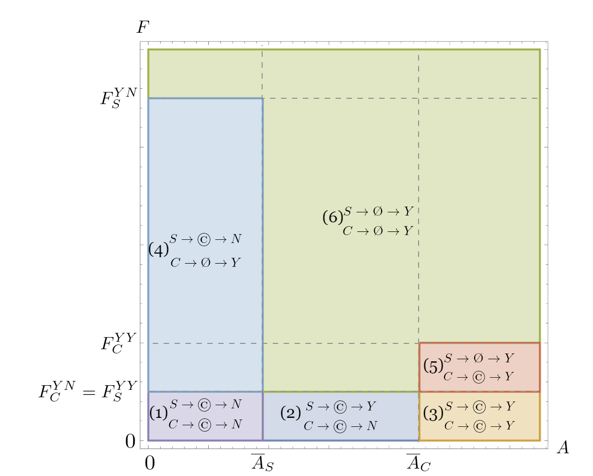
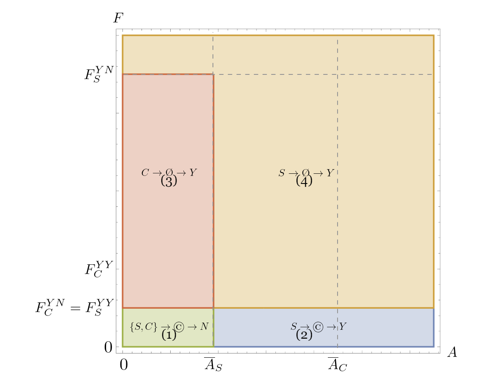

## Additional Notes

## Enumeration of the squares in the code

The following images will show, which square in the code corresponds to which area in the images in the paper.
The number of the square is denoted in brackets (i.e. (1)).

### BaseModel
- Best Answer of the incumbent to the choices of the entrant

- Equilibrium path

### BargainingPowerModel

### AcquisitionModel

### UnobservableModel

