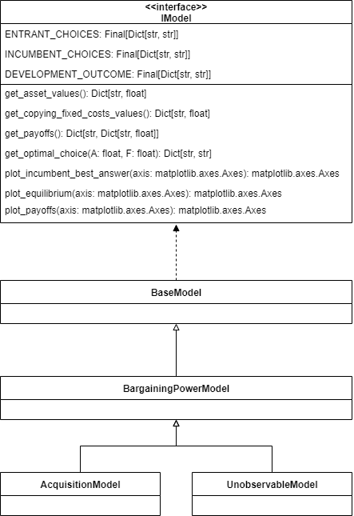
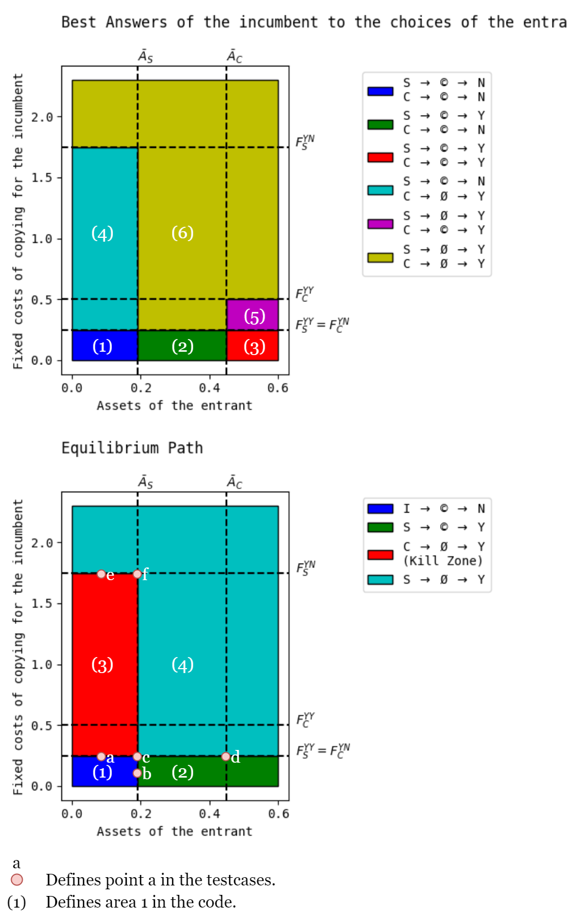
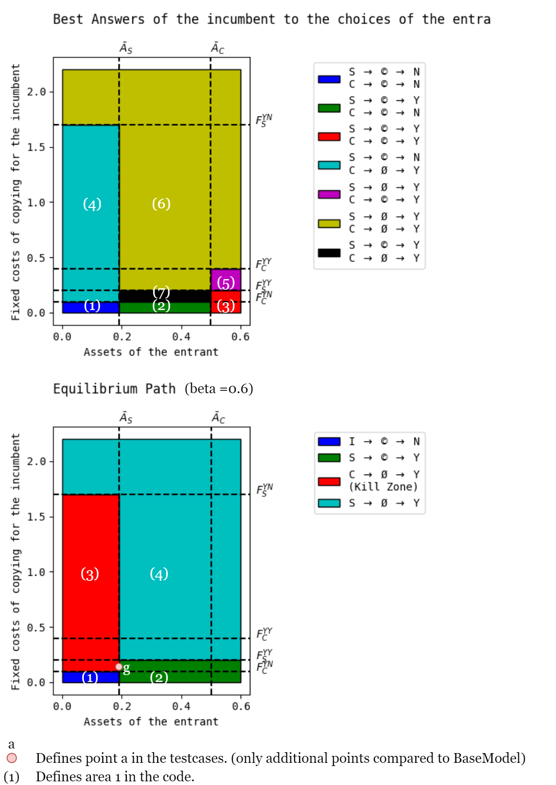
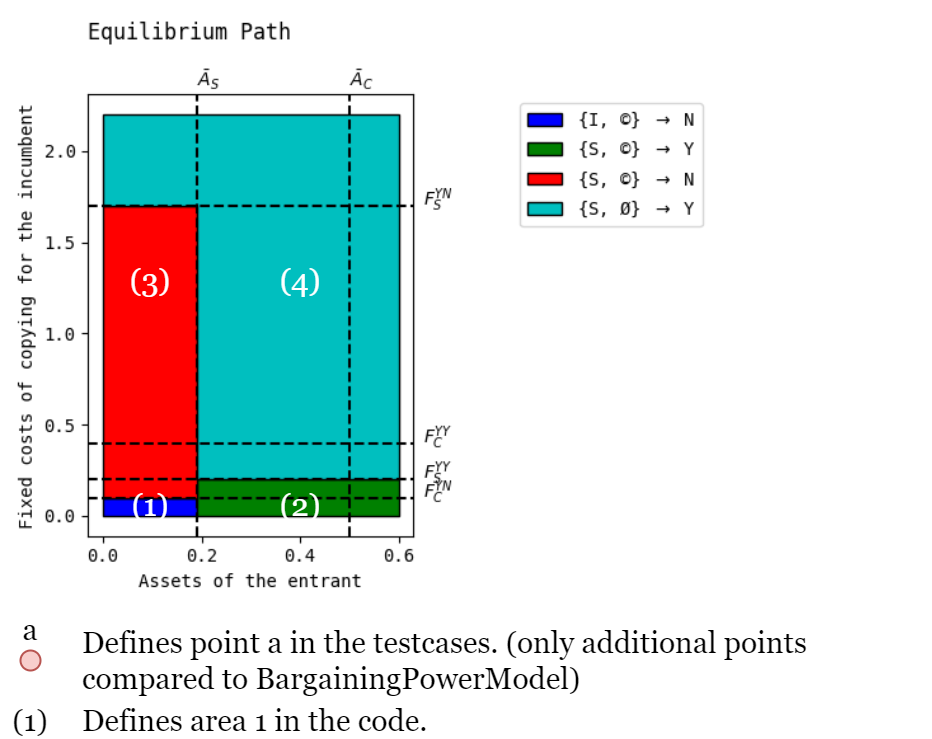
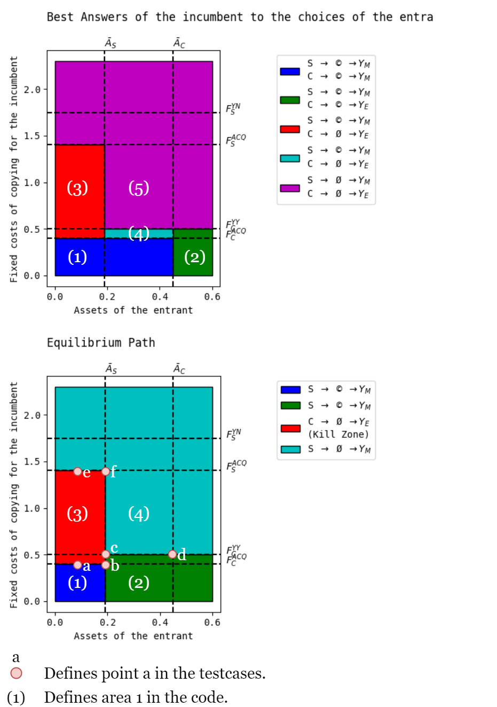

## Additional Notes

Here you can find some helpful information about the project and the code.

### Project Structure

```
.
+-- .github # includes workflows for the repository
|
+-- docs # includes the API - Documentation
|
+-- resources # includes this file and further files for the better understanding of the code
|
+-- Shelegia_Motta_2021 # package published on PyPI
|   +-- IModel.py # interface used in the models
|   +-- Models.py # models implementing the logic
|
+-- Shelegia_Motta_2021_Test # unittests for the package
|   +-- ModelTest.py # tests the equilibrium path logic (excluded from the PyPI package)
|
+-- demo.ipynb # demonstration of the functionality provided by the package and summary of the paper
|
+-- LICENSE # the package is published under the MIT - license
|
+-- README.md # contains an overview over the package and models 
|
+-- requirements.txt # contains all the informations for the necessary packages for this repository
|
+-- setup.py # contains all the informations to build and install the package
|
+-- Shelegia and Motta (2021).pdf # the package is based on this paper
```

### Class Hierarchy


The implementation of the classes can be found in Models.py.

### Enumeration of the Areas in the Code

The following images will show, which area in the code corresponds to which area in the images in the paper.
The number of the area is denoted in brackets (i.e. (1)).

Additionally, the points used in the testcases are denoted.

#### BaseModel


#### BargainingPowerModel


#### UnobservableModel


#### AcquisitionModel

